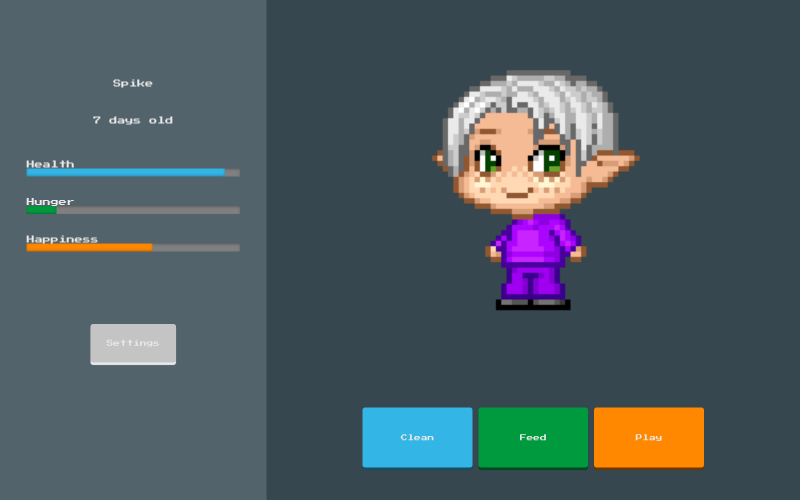

# Chingu Solo Project - Tier 1 - Virtual Pet

## Overview

In this Tier 1 project, you will create a web based tamagotchi inspired virtual pet. You will create a friendly pet blob with a design of your choosing, a stats panel health/hunger/happiness, and a set of interaction buttons feed/clean/play.
As you build up your skills you’ll be able to return to this project and add in the Tier 2 and Tier 3 features.

## Instructions

For this project you MUST use vanilla (plain) HTML/CSS and JavaScript. No Frameworks, Libraries, or Code Generators May Be Used In This Tier. You may make use of Web Components.

## Requirements

### Structure

You'll need to display the following:

- Sprite (can be as simple or detailed as you like but it should have some expressive facial features)
- Pet info
  - Name
  - Age
  - Health (0-100)
  - Hunger (0-100)
  - Happiness (0-100)
- Interactions
  - Clean
  - Feed
  - Play
- Game control
  - Speed control (optional)
  - Pet name input
  - Game reset button
- End game message

## Functionality

- At every N (i.e. 1000ms) interval, the 'pet day' should increase by 1

  - If implementing the optional speed control N should be updatable

- ### Every pet day:

  - Age should update showing the pet day
  - Health should decrease
  - Hunger should increase
  - Happiness should decrease by a random amount between a set range

- When Health gets to zero the game should end, displaying a message

- ### Interactive actions:

  - Clean should increase health
  - Feed should decrease hunger
  - Play should increase happiness

## Other

Your repo needs to have a robust README (see Keys to a [Well-Written Readme](https://medium.com/chingu/keys-to-a-well-written-readme-55c53d34fe6d))

## Extras (Not Required)

- Speed control (optional)
- Create different sprite versions
  - Happy face
  - Sad face
  - Dead face
- Sprite CSS Animations
  - Happy
  - Normal
  - Sad
